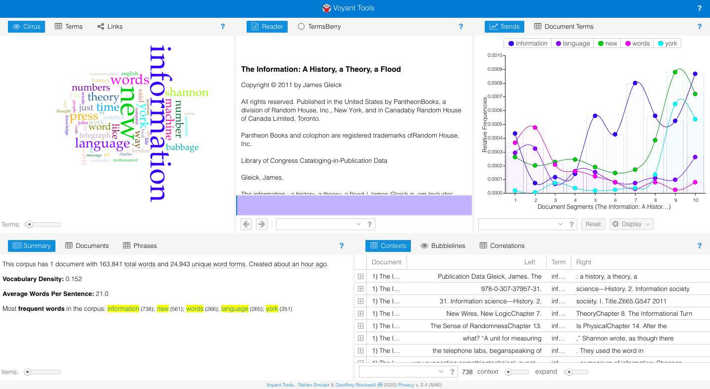
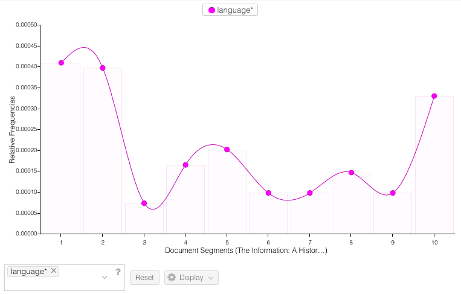

## I Am Back

- I did not actually cry and I **will** do it again just because I want to look back on my notes when I need them. 

- So I reviewed using [Voyant Tools](voyant-tools.org) because the *late*  blog post is about communication. I wanted to use this tool because I have been reading the PDF version of *The Information* and found that it is easier to command F online texts. For some reason, the version I have downloaded does not permit a good ole command F, so of course I thought of Voyant Tools. 

- After I got this assembly of the most frequent words, none of them really caught my attention so I started looking up words in the search bar. 

- I noticed that the word 'language' was mentioned most in the beginning of the book so I skimmed some of the earlier chapters to see Gleick's arguments. In Chapter 3, Gleick's discussion about how during the 16th Century, there was no consensus on how things were spelled. He used the example of a 1591 pamphlet where "the word cony (rabbit) appeared variously as conny, conye, conie, connie, coni, cuny, cunny, and cunnie...Others spelled it differently" (55). I understand that there was no agreement on the spelling of names because they were typically spoken, but I found it surprising that there were not any grammar rules and regulations prior. 
- What struck me most about these findings is that althought there were nine different spellings of the word, they all began with the letter 'C'. Who is to say that cony is not spelled with a 'K'? This passage begs a few questions: 
    - Do we *need* formally recorded writing conventions? 
    - If proper spelling and grammar is needed for communication, how do we understand each other even when someone is being improper? 

- I think spelling is where communication differs for an English major and a computer programmer because I have learned that when programming, you need to spell things correctly or *the computer* will not understand your command.  If I spell something wrong in a paper, my professor will still understand what I meant I would just be incorrect. 

Or would I? Whose job is it to police what is right or wrong when a word spelled wrong is pronounced the same way? 