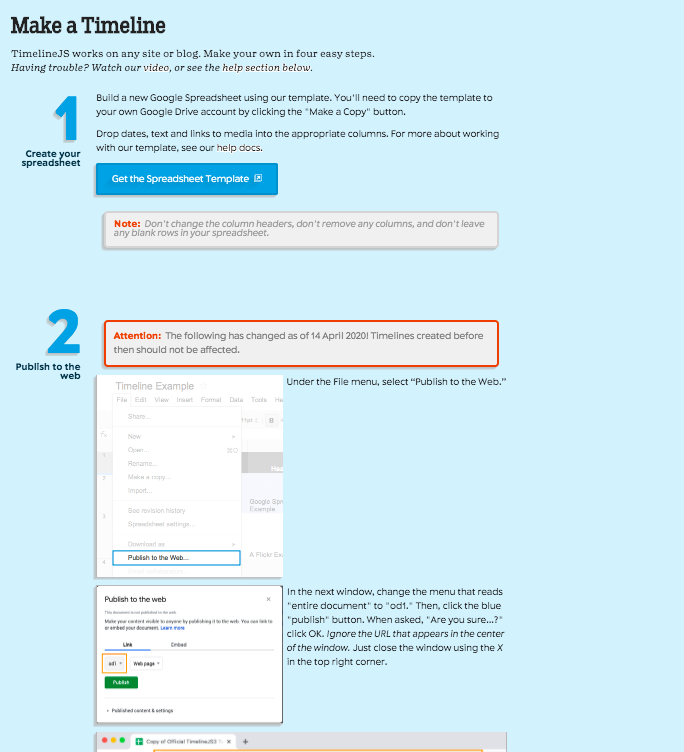
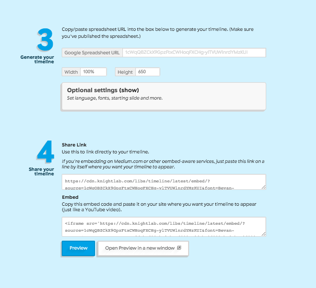
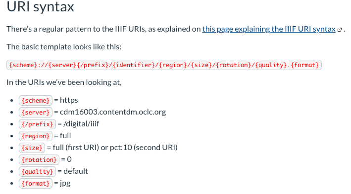

# What I Learned Today 

## TimelineJS 
- I went through the steps to creating a timeline and edited the [original template](https://docs.google.com/spreadsheets/d/1ay4Nqui-LpJQzg22SWxy8LH_82Y4L79YwIQ-yyR-hsk/edit#gid=0) to be about nails instead hehe

- Now, I have made another [practice timeline](https://docs.google.com/spreadsheets/d/1iHaBnEvOttaSauqgQigzdUiWaB8t7I-CYFxQDVjzun0/edit#gid=0) about the history of communication and computing based on what I have read in James Gleick's *The Information*.
    - I find making timelines to be really fun and a cool way to present information, I am a big fan! Therefore, I am going to put the steps here to make sure I remember.

- I have reached the page in the Canvas module about changing the way an image appears using its link and will attempt to do so after this image 
    
    

- Now, I would like to try displaying only a section of the page because I got kind of lost at that part of the module. 

 
    - I do not know what I was expecting when I plugged random numbers in for the coordinates, but hey it worked. 

- I have completed the module, "Reading as an Editor," (for the most part). [Here](https://docs.google.com/spreadsheets/d/1G309K3APxhql64b6E39yM_5PRdd_DPAgSkq0FVD6nSE/edit#gid=0) is my timeline practice using the manuscript images provided. I shall finish the rest of the hidden assignments in the module now :)

