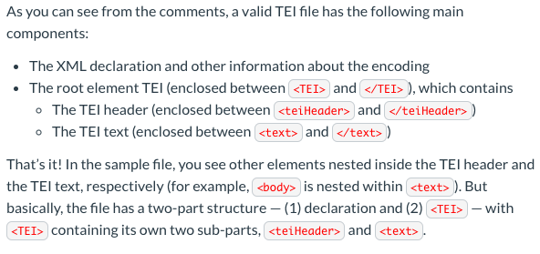

# What I Learned Today

(Note: This may be a bit short, I am so tired right now)

## Text Encoding

- Text Encoding Initiative, or *TEI*, is a metalanguage. A metalanguage is used to describe what something (a text) is composed of.
    - TEI itself is a kind of *XML*, or eXtensible Markup Language.
    - While TEI bares similarities to my favorite metalanguage, HTML, the two function differently. 
    
    - HTML is for properly formatting something for the web while TEI is for "making statements about a text."

- **Why use TEI?**
    - A computer only understands so many concepts, like how to insert page breaks in a webpage. So "we need a precise metalanguauge" that can tell a computer exactly what to do and when. 

- **TEI Basics**

    - Different Elements
        - <app> introduces a place of variance from the base (or reference version), whatever that means
        - <lem> contains texts as it appears in the base
        - <rdg> indicates how the text reads in one or more of the witnesses 
        - <del> indicates deleted text
        - <add> indicates inserted text 

Okay, I think that is enough for today, I will be back tomorrow to finish up the "Reading as an Editor II" module on Canvas. This means trying my hand at editing my own TEI file, yay! (I'm kind of nervous)